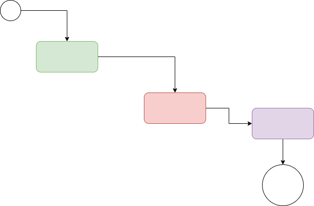

# Projeto 1

## Sobre este projeto

Podemos já  **vislumbrar** o `modo` pelo qual o aumento do diálogo entre os diferentes setores produtivos agrega valor ao estabelecimento do sistema de formação de quadros que corresponde às necessidades. Podemos já vislumbrar o modo pelo qual o aumento do diálogo entre os diferentes setores produtivos agrega valor ao estabelecimento do sistema de formação de `quadros` que corresponde às necessidades.
Podemos já **vislumbrar** o modo pelo qual o aumento do diálogo entre os diferentes setores produtivos agrega valor ao estabelecimento do sistema de formação de quadros que corresponde às necessidades.

  - teste
  - teste2
  
Podemos já vislumbrar o modo pelo qual o aumento do diálogo entre os diferentes setores produtivos agrega valor ao estabelecimento do sistema de formação de quadros que corresponde às necessidades.

## Diagrama

A prática cotidiana prova que a consulta aos diversos militantes estimula a padronização das direções preferenciais no sentido do progresso.

## Diagrama 2

